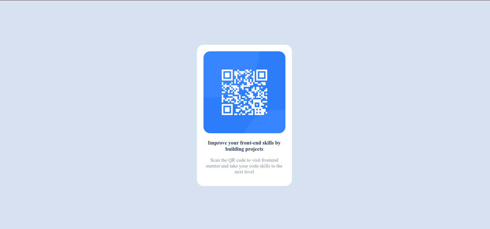

# Frontend Mentor - QR code component solution

This is a solution to the [QR code component challenge on Frontend Mentor](https://www.frontendmentor.io/challenges/qr-code-component-iux_sIO_H). Frontend Mentor challenges help you improve your coding skills by building realistic projects. 

## Table of contents

- [Overview](#overview)
  - [Screenshot](#screenshot)
  - [Links](#links)
- [My process](#my-process)
  - [Built with](#built-with)
  - [What I learned](#what-i-learned)
  - [Continued development](#continued-development)
  - [Useful resources](#useful-resources)
- [Author](#author)
**Note: Delete this note and update the table of contents based on what sections you keep.**

## Overview

### Screenshot




### Links

- Solution URL: [Add solution URL here](https://github.com/AfroHabesha/QR-code-component)
- Live Site URL: [Add live site URL here](https://afrohabesha.github.io/QR-code-component/)

## My process

### Built with

- Semantic HTML5 markup
- CSS custom properties


### What I learned

used to center a div without using flex-box or grid
```css
.wrapper {
    position: absolute;
    inset: 0;
    margin: auto;
}
```

### Continued development

css positioning

### Useful resources

https://youtu.be/ULVu2VNM_54

## Author

- Frontend Mentor - [@Afro Habesha](https://www.frontendmentor.io/profile/AfroHabesha)
